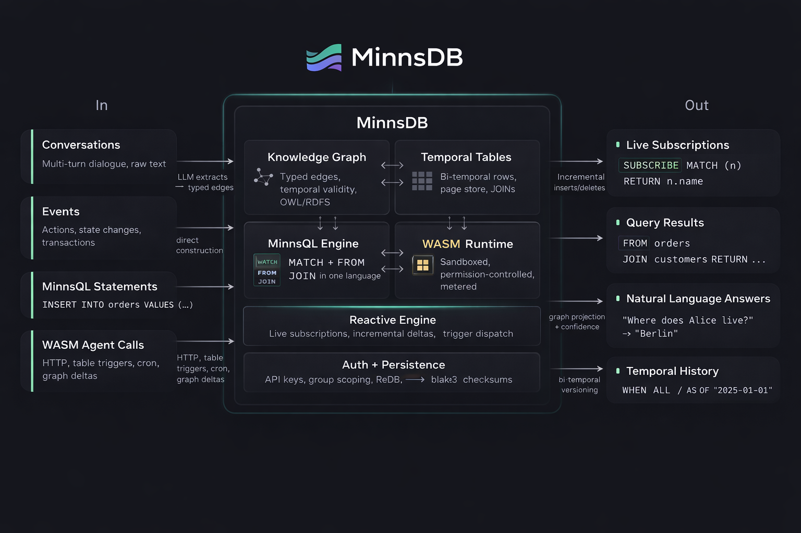

# @minns/agent-forge

Build autonomous agents that remember everything, reason about complex tasks, coordinate with each other, and query their own knowledge in real time.

```bash
npm install @minns/agent-forge
```

```typescript
import { AgentForge, OpenAIProvider, MinnsMemory, MinnsFullPowerMiddleware } from "@minns/agent-forge";
import { createClient } from "minns-sdk";

const client = createClient(process.env.MINNS_KEY!);

const agent = new AgentForge({
  directive: {
    identity: "You are a senior engineering assistant with full access to the team's knowledge graph.",
    goalDescription: "Help engineers ship faster by finding answers, tracking work, and coordinating across repos",
  },
  llm: new OpenAIProvider({ apiKey: process.env.OPENAI_KEY!, model: "gpt-4o" }),
  memory: new MinnsMemory({ client }),
  agentId: 1,
  middleware: [
    new MinnsFullPowerMiddleware({
      client,
      groupId: "engineering",
      enableTools: ["graph", "tables", "query", "subscriptions", "search"],
    }),
  ],
});

const result = await agent.run("What caused the auth service outage last week and who's fixing it?", {
  sessionId: 1,
});
// Agent uses: hybrid_search → finds claims about the outage
// Agent uses: graph_query → traces causal chain from deploy → config error → 503s
// Agent uses: minnsql_execute → checks workflow steps assigned to team members
// Returns a detailed answer with entity references and timeline
```

---

## Why agent-forge

Most agent frameworks give you a prompt loop and call it a day. agent-forge gives you:

- **A 10-phase execution pipeline** with intent classification, planning, tool execution, goal tracking, and reasoning
- **Graph-native memory** that actually understands relationships between facts, not just vector similarity
- **Temporal tables and MinnsQL** so your agent can create, query, and subscribe to structured data in real time
- **Multi-agent coordination** where agents in separate terminals discover each other and split work through a shared graph
- **Composable middleware** that controls every aspect of the pipeline without touching core code
- **Five reasoning engines** including MCTS tree search and world model simulation

You can use all of this, or just the parts you need. An agent with no memory and no middleware still works — it's just a prompt + tool loop.

---

## Examples

### Simple coding assistant (no memory, no middleware)

```typescript
import { AgentForge, OpenAIProvider } from "@minns/agent-forge";
import type { ToolDefinition } from "@minns/agent-forge";

const runCode: ToolDefinition = {
  name: "run_code",
  description: "Execute a shell command and return stdout/stderr",
  parameters: {
    command: { type: "string", description: "Shell command to execute" },
  },
  async execute(params) {
    const { execSync } = await import("child_process");
    try {
      const output = execSync(params.command, { encoding: "utf-8", timeout: 30_000 });
      return { success: true, result: { stdout: output } };
    } catch (err: any) {
      return { success: false, error: err.stderr ?? err.message };
    }
  },
};

const agent = new AgentForge({
  directive: {
    identity: "You are a coding assistant. Run commands to help the user.",
    goalDescription: "Execute code and explain results",
  },
  llm: new OpenAIProvider({ apiKey: process.env.OPENAI_KEY!, model: "gpt-4o-mini" }),
  agentId: 1,
  tools: [runCode],
});

const result = await agent.runSimple("List all TypeScript files in src/ and count them");
// Agent uses: run_code → "find src -name '*.ts' | wc -l"
// Returns: "There are 24 TypeScript files in the src/ directory."
```

### Research agent with file memory (no minns)

```typescript
import { AgentForge, AnthropicProvider, FileMemory, FilesystemBackend } from "@minns/agent-forge";

const agent = new AgentForge({
  directive: {
    identity: "You are a research assistant that remembers everything in markdown files.",
    goalDescription: "Research topics and maintain a knowledge base in AGENTS.md",
  },
  llm: new AnthropicProvider({ apiKey: process.env.ANTHROPIC_KEY!, model: "claude-sonnet-4-6" }),
  memory: new FileMemory({
    backend: new FilesystemBackend({ rootDir: "." }),
    paths: ["./AGENTS.md"],
  }),
  agentId: 1,
  tools: [webSearchTool, readUrlTool],
});

// Agent searches the web, stores findings in AGENTS.md, recalls them next session
await agent.run("Research the latest developments in WebAssembly GC", { sessionId: 1 });

// Next day — agent reads AGENTS.md and picks up where it left off
await agent.run("What did we find about WasmGC yesterday?", { sessionId: 2 });
```

### Task planner with todo middleware (no minns)

```typescript
import { AgentForge, OpenAIProvider, TodoListMiddleware, ContextSummarizationMiddleware } from "@minns/agent-forge";

const planner = new AgentForge({
  directive: {
    identity: "You are a project planner. Break down complex tasks into steps and track progress.",
    goalDescription: "Help the user plan and execute multi-step projects",
  },
  llm: new OpenAIProvider({ apiKey: process.env.OPENAI_KEY!, model: "gpt-4o" }),
  agentId: 1,
  middleware: [
    new TodoListMiddleware(),
    new ContextSummarizationMiddleware({ tokenBudget: 80_000 }),
  ],
  tools: [readFileTool, writeFileTool, runTestsTool],
});

await planner.run("Refactor the authentication module to use JWT tokens instead of sessions", { sessionId: 1 });
// Agent uses: write_todos → creates a structured plan:
//   1. Audit current session-based auth (in_progress)
//   2. Design JWT token schema and refresh flow
//   3. Implement JWT middleware
//   4. Update login/logout endpoints
//   5. Write migration for existing sessions
//   6. Update tests
// Agent uses: readFileTool → reads current auth implementation
// Agent uses: writeFileTool → starts implementing changes
// Agent uses: write_todos → marks step 1 done, starts step 2
```

### Parallel research with graph execution (no minns)

```typescript
import { AgentGraph, InMemoryCheckpointer, END, appendReducer } from "@minns/agent-forge";

interface ResearchState {
  topic: string;
  sources: string[];   // ← appendReducer: parallel nodes all push here
  synthesis: string;
}

const research = new AgentGraph<ResearchState>({
  reducers: { sources: appendReducer },
})
  .addNode("scholar", async (state) => {
    const papers = await searchGoogleScholar(state.topic);
    return { sources: papers.map((p) => `[Scholar] ${p.title}: ${p.summary}`) };
  })
  .addNode("news", async (state) => {
    const articles = await searchNews(state.topic);
    return { sources: articles.map((a) => `[News] ${a.headline}: ${a.summary}`) };
  })
  .addNode("reddit", async (state) => {
    const posts = await searchReddit(state.topic);
    return { sources: posts.map((p) => `[Reddit] ${p.title}: ${p.body}`) };
  })
  .addNode("synthesize", async (state) => {
    const response = await llm.complete(
      `Synthesize these sources about "${state.topic}":\n\n${state.sources.join("\n\n")}`,
    );
    return { synthesis: response };
  })
  .setEntryPoint("scholar")
  .addParallelEdge("scholar", ["scholar", "news", "reddit"], "synthesize")
  .addEdge("synthesize", END)
  .compile({ checkpointer: new InMemoryCheckpointer() });

const result = await research.invoke(
  { topic: "impact of AI on software testing", sources: [], synthesis: "" },
  { threadId: "research-1" },
);
console.log(result.state.synthesis);
// Combines academic papers + news articles + Reddit discussions into one synthesis
```

### Customer support agent with memory

```typescript
const support = new AgentForge({
  directive: {
    identity: "You are a customer support agent for an e-commerce platform.",
    goalDescription: "Resolve customer issues using their order history and preferences",
  },
  llm: new OpenAIProvider({ apiKey: process.env.OPENAI_KEY! }),
  memory: new MinnsMemory({ client: createClient(process.env.MINNS_KEY!) }),
  agentId: 1,
  tools: [lookupOrderTool, refundTool, escalateTool],
});

// First conversation
await support.run("I ordered a blue jacket last week but got a red one", { sessionId: 1, userId: "customer-42" });
// Agent recalls: customer-42's order history, past preferences, previous complaints
// Agent uses: lookupOrderTool → finds order #8891, confirms color mismatch
// Agent uses: refundTool → initiates replacement
// Memory stores: "customer-42 received wrong color jacket, replacement initiated for order #8891"

// Later conversation — agent remembers everything
await support.run("Did my replacement ship yet?", { sessionId: 2, userId: "customer-42" });
// Agent recalls the replacement from the previous session automatically
```

### Data analyst that creates and queries tables

```typescript
const analyst = new AgentForge({
  directive: {
    identity: "You are a data analyst. You create tables, import data, and answer questions with MinnsQL.",
    goalDescription: "Help users explore and analyze their data",
  },
  llm: new AnthropicProvider({ apiKey: process.env.ANTHROPIC_KEY!, model: "claude-sonnet-4-6" }),
  agentId: 1,
  middleware: [
    new MinnsFullPowerMiddleware({
      client: createClient(process.env.MINNS_KEY!),
      enableTools: ["tables", "query", "search"],
    }),
  ],
});

await analyst.run("Create a sales table and load this quarter's data", { sessionId: 1 });
// Agent uses: table_create → "sales" with columns [id Int64 PK, rep String, amount Float64, region String, closed_at Timestamp]
// Agent uses: table_insert → loads rows from the conversation

await analyst.run("Which region had the highest total sales?", { sessionId: 1 });
// Agent uses: minnsql_execute → 'FROM sales GROUP BY sales.region RETURN sales.region, sum(sales.amount) AS total ORDER BY total DESC LIMIT 1'
// Note: MinnsQL syntax puts GROUP BY before RETURN
// Returns: "West region with $284,000 in total sales"

await analyst.run("Show me how that changed over time", { sessionId: 1 });
// Agent uses: minnsql_execute → 'FROM sales WHERE sales.region = "West" RETURN time_bucket(sales.closed_at, "month"), sum(sales.amount) ORDER BY time_bucket'
```

### DevOps agent that monitors and reacts

```typescript
const devops = new AgentForge({
  directive: {
    identity: "You are a DevOps monitoring agent. Track deployments, incidents, and service health.",
    goalDescription: "Keep the team informed about infrastructure changes and alert on anomalies",
  },
  llm: new OpenAIProvider({ apiKey: process.env.OPENAI_KEY!, model: "gpt-4o" }),
  agentId: 1,
  middleware: [
    new MinnsFullPowerMiddleware({
      client: createClient(process.env.MINNS_KEY!),
      groupId: "infra-team",
      enableTools: ["graph", "tables", "query", "subscriptions", "temporal"],
    }),
  ],
});

await devops.run("Set up monitoring for our deployment pipeline", { sessionId: 1 });
// Agent uses: table_create → "deployments" with columns [id Int64 PK, service String, version String, status String, deployed_at Timestamp, node NodeRef]
// Agent uses: subscription_create → subscribes to 'FROM deployments WHERE deployments.status = "failed" RETURN deployments.service, deployments.version'
// Returns: "Monitoring active. I'll detect any failed deployments."

await devops.run("Anything go wrong today?", { sessionId: 1 });
// Agent uses: subscription_poll → checks for failed deployments since last check
// Agent uses: temporal_causal_path → traces what caused the failure
// Agent uses: minnsql_execute → 'FROM deployments WHEN ago("24h") GROUP BY deployments.service, deployments.status RETURN deployments.service, deployments.status, count(*) AS cnt'
```

### Multi-agent feature build

```typescript
import { MultiAgentMiddleware } from "@minns/agent-forge";

const client = createClient(process.env.MINNS_KEY!);

// Terminal 1 — backend agent
const backend = new AgentForge({
  directive: {
    identity: "You are a backend engineer. You write APIs, database schemas, and server logic.",
    goalDescription: "Build backend components for the team's feature requests",
  },
  llm: new AnthropicProvider({ apiKey: process.env.ANTHROPIC_KEY! }),
  agentId: 1,
  tools: [readFileTool, writeFileTool, runTestsTool],
  middleware: [
    new MultiAgentMiddleware({
      client,
      agentId: "backend-eng",
      groupId: "feature-auth-v2",
      capabilities: ["api", "database", "auth"],
    }),
  ],
});

// Terminal 2 — frontend agent
const frontend = new AgentForge({
  directive: {
    identity: "You are a frontend engineer. You build React components and handle client-side logic.",
    goalDescription: "Build frontend components that integrate with the backend APIs",
  },
  llm: new AnthropicProvider({ apiKey: process.env.ANTHROPIC_KEY! }),
  agentId: 2,
  tools: [readFileTool, writeFileTool, runTestsTool],
  middleware: [
    new MultiAgentMiddleware({
      client,
      agentId: "frontend-eng",
      groupId: "feature-auth-v2",
      capabilities: ["react", "ui", "components"],
    }),
  ],
});

// Either agent can:
// - discover_agents → find peers in the group
// - create_shared_workflow → "Build OAuth2 login flow" with steps for each agent
// - send_agent_message → "API endpoint is ready at POST /api/auth/token"
// - watch_for_work → subscribe to pending tasks assigned to them
// - poll_updates → check for new messages and completed steps
// - query_graph → 'MATCH (s:Concept {status: "completed"})-[e]->(w) RETURN s.step_name, w.name'
```

### Workflow with human-in-the-loop approval

```typescript
import { AgentGraph, InMemoryCheckpointer, END } from "@minns/agent-forge";

interface DeployState {
  service: string;
  plan: string;
  tests_passed: boolean;
  approved: boolean;
  deployed: boolean;
}

const deployPipeline = new AgentGraph<DeployState>()
  .addNode("plan", async (state) => {
    return { plan: `Deploy ${state.service}: run tests → build image → push to staging → promote to prod` };
  })
  .addNode("test", async (state) => {
    const passed = await runTestSuite(state.service);
    return { tests_passed: passed };
  })
  .addNode("deploy", async (state) => {
    await deployToProduction(state.service);
    return { deployed: true };
  })
  .setEntryPoint("plan")
  .addEdge("plan", "test")
  .addConditionalEdge("test", (s) => s.tests_passed ? "deploy" : END, ["deploy"])
  .addEdge("deploy", END)
  .compile({
    checkpointer: new InMemoryCheckpointer(),
    interruptBefore: ["deploy"],  // pause here for human approval
  });

// Run until the approval gate
const r1 = await deployPipeline.invoke(
  { service: "auth-service", plan: "", tests_passed: false, approved: false, deployed: false },
  { threadId: "deploy-42" },
);
// r1.status === "interrupted" — tests passed, waiting for approval

console.log(r1.state.plan);     // "Deploy auth-service: run tests → build image → ..."
console.log(r1.state.tests_passed); // true

// Human approves and resumes
await deployPipeline.updateState("deploy-42", { approved: true });
const r2 = await deployPipeline.invoke(r1.state, { threadId: "deploy-42" });
// r2.status === "complete", r2.state.deployed === true
```

### Bulk-loading historical conversations

```typescript
import { MinnsMemory } from "@minns/agent-forge";
import { createClient } from "minns-sdk";

const memory = new MinnsMemory({ client: createClient(process.env.MINNS_KEY!) });

// Load a year of Slack conversations into the knowledge graph
await memory.ingestBulk({
  caseId: "slack-engineering",
  sessions: [
    {
      sessionId: "thread-2024-03-15",
      topic: "Database migration",
      messages: [
        { role: "user", content: "We're migrating from MySQL to PostgreSQL this quarter" },
        { role: "user", content: "Alice is leading the migration, Bob is handling the data pipeline" },
        { role: "assistant", content: "Migration plan confirmed. PostgreSQL target, Q1 timeline." },
      ],
    },
    {
      sessionId: "thread-2024-04-02",
      topic: "Incident post-mortem",
      messages: [
        { role: "user", content: "The auth service went down because the connection pool was exhausted" },
        { role: "user", content: "Root cause: the new ORM wasn't releasing connections on error paths" },
        { role: "user", content: "Fix: added connection timeout + retry with exponential backoff" },
      ],
    },
    // ... hundreds more sessions
  ],
  includeAssistantFacts: true,
});

// Now any agent with this memory can answer:
// "Who's leading the database migration?" → "Alice"
// "What caused the last auth outage?" → "Connection pool exhaustion from unreleased connections in the new ORM"
// "What was the fix?" → "Connection timeout + retry with exponential backoff"
```

### Streaming to a frontend via SSE

```typescript
import express from "express";

const app = express();

app.get("/api/chat", async (req, res) => {
  res.setHeader("Content-Type", "text/event-stream");
  res.setHeader("Cache-Control", "no-cache");

  await agent.runWithEvents(req.query.message as string, (event) => {
    if (event.type === "stream_chunk") {
      res.write(`data: ${JSON.stringify({ type: "token", text: event.data.delta })}\n\n`);
    }
    if (event.type === "actions") {
      res.write(`data: ${JSON.stringify({ type: "tool_use", actions: event.data.actions })}\n\n`);
    }
    if (event.type === "done") {
      res.write(`data: ${JSON.stringify({ type: "done", result: event.data })}\n\n`);
      res.end();
    }
  }, { sessionId: parseInt(req.query.session as string) });
});
```

---

## Architecture

agent-forge runs a 10-phase execution pipeline on every message:

```
 1. Intent Classification    LLM classifies user intent (ask, inform, action, etc.)
 2. Semantic Write           Sends message to minns for graph ingestion + claim extraction
 3. Memory Retrieval         Hybrid search (BM25 + semantic + RRF) + NLQ in parallel
 4. Plan Generation          LLM generates a multi-step plan for complex tasks
 5. Auto-Store               Automatically stores facts for inform-type intents
 6. Action Loop              Flat tool loop or MCTS tree search with tool execution
 7. Reasoning                Stores reasoning steps back into the graph
 8. Goal Check               Evaluates progress, handles goal completion
 9. Response Generation      LLM generates the final response
10. Finalize                 Stores assistant message, updates conversation history
```

The pipeline is wrapped by a composable middleware stack. Middleware can intercept at three points: before execution, around every LLM call, and after execution.

Two execution modes:

- **`agent.run(message, options)`** — full 10-phase pipeline
- **`agent.runSimple(task)`** — lightweight ReAct loop (system prompt + tool loop), no memory or intent parsing

---

## Memory

Memory is pluggable. Three built-in options:

```typescript
// 1. minns — graph-native memory with hybrid search, NLQ, claim extraction, temporal tables
import { MinnsMemory } from "@minns/agent-forge";
import { createClient } from "minns-sdk";
const agent = new AgentForge({
  memory: new MinnsMemory({ client: createClient("your-key") }),
  // ...
});

// 2. File-based — reads/writes markdown files, keyword search
import { FileMemory, FilesystemBackend } from "@minns/agent-forge";
const agent = new AgentForge({
  memory: new FileMemory({
    backend: new FilesystemBackend({ rootDir: "." }),
    paths: ["./AGENTS.md"],
  }),
  // ...
});

// 3. No memory — agent works, just no cross-session recall
const agent = new AgentForge({ /* directive + llm only */ });
```

Any object implementing `ingest()` and `recall()` works as a custom memory provider.

When using `MinnsMemory`, recall automatically uses **hybrid search** (BM25 keyword + semantic embeddings + RRF fusion) for better retrieval than pure vector search. Falls back to `searchClaims()` if the hybrid endpoint isn't available.

---

## Middleware

Compose agent behavior from modular middleware. Each middleware can contribute tools, modify the system prompt, wrap LLM calls, and manage state across turns.

```typescript
const agent = new AgentForge({
  middleware: [
    new ContextSummarizationMiddleware({ tokenBudget: 100_000 }), // compress long conversations
    new TodoListMiddleware(),                                      // structured task planning
    new HumanInTheLoopMiddleware({ require: ["deploy_*"] }),       // approval gates
    new PromptCacheMiddleware(),                                   // Anthropic cache control
    new MinnsFullPowerMiddleware({ client, enableTools: ["tables", "query"] }),
  ],
  // ...
});
```

### Built-in Middleware

| Middleware | What it does |
|-----------|-------------|
| `ContextSummarizationMiddleware` | Two-tier context compaction: argument truncation + LLM summarization |
| `TodoListMiddleware` | `write_todos` / `get_todos` tools for structured task planning |
| `HumanInTheLoopMiddleware` | Approval gates on specific tools with pluggable UI handlers |
| `PromptCacheMiddleware` | Anthropic prompt cache control for stable prompt prefixes |
| `MinnsFullPowerMiddleware` | Full minns data layer: tables, MinnsQL, subscriptions, graph, analytics, code |
| `MultiAgentMiddleware` | Cross-terminal agent coordination via shared knowledge graph |
| `VibeGraphMiddleware` | Natural language to executable multi-agent workflow graphs |
| `SubAgentIsolationMiddleware` | Isolated sub-agents with fresh context windows |
| `AsyncSubAgentMiddleware` | Background tasks: start, check, cancel, list |
| `SkillsMiddleware` | Progressive disclosure: SKILL.md files loaded on demand |
| `PatchToolCallsMiddleware` | Fixes dangling tool calls from interrupted conversations |
| `ToolResultEvictionMiddleware` | Replaces large tool results with summaries |
| `ArgumentTruncationMiddleware` | Truncates old tool call arguments to save context |

---

## MinnsFullPowerMiddleware


> **MinnsDB is entirely optional.** agent-forge works without it — see the examples above using `FileMemory`, `TodoListMiddleware`, or no memory at all. Add MinnsFullPowerMiddleware when you want graph-native memory, temporal tables, MinnsQL, and reactive subscriptions.

Unleashes the full minns-sdk data layer as agent tools. Pick the tool sets you need:

```typescript
new MinnsFullPowerMiddleware({
  client: createClient("your-key"),
  groupId: "my-team",                                                    // multi-tenant scoping
  enableTools: ["graph", "tables", "query", "subscriptions", "search"],  // or omit for all
})
```

<p align="center">
  
</p>

### Temporal Tables (`"tables"`)

Bi-temporal relational tables with automatic version history. Every update creates a new version — old versions remain queryable via point-in-time queries. `NodeRef` columns link rows directly to graph nodes.

| Tool | Description |
|------|-------------|
| `table_create` | Create a table with typed columns: String, Int64, Float64, Bool, Timestamp, Json, NodeRef |
| `table_insert` | Insert rows (single or batch, positional values) |
| `table_scan` | Scan rows: active (default), all versions, or point-in-time snapshots |
| `table_update` | Update a row (creates new version, closes old version's `valid_until`) |
| `table_delete` | Soft-delete (remains queryable via `when: "all"`) |
| `table_list` | List all tables with schemas |
| `table_stats` | Active rows, total versions, pages, generation |

### MinnsQL (`"query"`)

Cypher-inspired query language that works across both the knowledge graph and temporal tables.

| Tool | Description |
|------|-------------|
| `minnsql_execute` | Run any MinnsQL: MATCH, FROM, JOIN, WHEN/AS OF, aggregations, DDL/DML |

```sql
-- Graph pattern matching
MATCH (a:Person)-[r:location]->(b) RETURN a.name, b.name

-- Table queries
FROM orders WHERE orders.status = "shipped" RETURN orders.customer, orders.amount

-- Graph-to-table JOINs
MATCH (n:Person) JOIN orders ON orders.node = n RETURN n.name, orders.amount

-- Temporal queries with Allen's interval algebra
MATCH (a)-[r]->(b) WHEN "2024-01-01" TO "2024-06-01" RETURN a.name

-- Aggregations
FROM sales GROUP BY sales.region RETURN sales.region, sum(sales.amount) AS total ORDER BY total DESC

-- Time bucketing
FROM events GROUP BY time_bucket(events.ts, "hour") RETURN time_bucket(events.ts, "hour"), count(*) AS cnt
```

### Reactive Subscriptions (`"subscriptions"`)

Subscribe to MinnsQL queries and receive incremental updates as the graph changes. Subscriptions are automatically cleaned up when the pipeline finishes.

| Tool | Description |
|------|-------------|
| `subscription_create` | Subscribe to a MinnsQL query, get initial result set |
| `subscription_poll` | Get inserts and deletes since last poll |
| `subscription_list` | List active subscriptions |
| `subscription_delete` | Unsubscribe |

### Graph, Search, Analytics, Temporal, Code

| Tool Set | Tools |
|----------|-------|
| `"graph"` | `graph_query` (NLQ), `graph_traverse`, `graph_structure` |
| `"search"` | `hybrid_search` (BM25 + semantic + RRF fusion) |
| `"analytics"` | `analytics_overview`, `analytics_communities`, `analytics_importance`, `analytics_related` (PageRank) |
| `"temporal"` | `temporal_causal_path`, `temporal_reachability` |
| `"code"` | `index_code` (AST + semantic), `search_code` |

---

## Graph Execution Engine

Build workflows as directed graphs with branching, looping, parallel execution, checkpointing, and human-in-the-loop interrupts.

```typescript
import { AgentGraph, InMemoryCheckpointer, END } from "@minns/agent-forge";

const pipeline = new AgentGraph<ResearchState>()
  .addNode("search", async (state) => {
    const results = await searchWeb(state.query);
    return { sources: results };
  })
  .addNode("analyze", async (state) => {
    const analysis = await llm.complete(`Analyze these sources: ${JSON.stringify(state.sources)}`);
    return { analysis };
  })
  .addNode("review", async (state) => {
    return { quality: state.analysis.length > 500 ? "good" : "needs_more" };
  })
  .setEntryPoint("search")
  .addEdge("search", "analyze")
  .addEdge("analyze", "review")
  .addConditionalEdge("review", (s) => s.quality === "good" ? END : "search", ["search"])
  .compile({ checkpointer: new InMemoryCheckpointer() });
```

**Features:**
- **Parallel execution** — `addParallelEdge("start", ["a", "b", "c"], "join")`
- **Subgraph composition** — `addSubgraph("research", compiledGraph, { mapInput, mapOutput })`
- **State reducers** — `appendReducer`, `counterReducer`, `mergeReducer`, `unionReducer`
- **Checkpointing** — `InMemoryCheckpointer` or `MinnsCheckpointer` for graph-persisted state
- **Human-in-the-loop** — `interruptBefore: ["deploy"]` pauses for approval
- **Streaming** — `graph.stream(input)` yields events as nodes execute

---

## Reasoning Engines

```typescript
const agent = new AgentForge({
  reasoning: {
    adaptiveCompute: true,    // meta-reasoner skips phases for simple queries
    treeSearch: true,         // MCTS with UCB1 selection for complex multi-step tasks
    branchingFactor: 3,       // explore 3 action branches per node
    maxDepth: 4,              // max tree depth
    reflexion: true,          // inject constraints from past failures as guardrails
    selfCritique: true,       // validate and rewrite responses before sending
    worldModel: true,         // simulate action outcomes, predict risk before executing
  },
  // ...
});
```

- **Adaptive Compute** — classifies query complexity, skips unnecessary pipeline phases for simple questions
- **MCTS Tree Search** — Monte Carlo tree search explores multiple action paths, picks the best
- **Reflexion** — extracts constraints from past failures, prevents repeating mistakes
- **World Model** — simulates "what would happen if I did X" before executing
- **Self-Critique** — evaluates response quality, rewrites if it doesn't meet criteria

---

## Tools

```typescript
import type { ToolDefinition } from "@minns/agent-forge";

const searchDocsTool: ToolDefinition = {
  name: "search_docs",
  description: "Search internal documentation for relevant information",
  parameters: {
    query: { type: "string", description: "Search query" },
    limit: { type: "string", description: "Max results", optional: true },
  },
  async execute(params, context) {
    // context gives you: agentId, sessionId, userId, memory, client, sessionState, services
    const results = await context.services.docs.search(params.query, parseInt(params.limit ?? "10"));
    return { success: true, result: results };
  },
};

const agent = new AgentForge({
  tools: [searchDocsTool],
  services: { docs: myDocsService },
  // ...
});
```

Both LLM providers (OpenAI, Anthropic) support native tool-use protocols. Automatic fallback to JSON parsing for providers without native support.

---

## LLM Providers

```typescript
// OpenAI-compatible — works with OpenAI, Azure, Groq, Together, OpenRouter, vLLM, Ollama
new OpenAIProvider({ apiKey: "...", model: "gpt-4o", baseUrl: "https://..." })

// Anthropic — native SDK with tool_use, prompt caching, streaming
new AnthropicProvider({ apiKey: "...", model: "claude-sonnet-4-6" })
```

---

## Streaming

```typescript
// Async generator
for await (const event of agent.stream("Build me a dashboard", { sessionId: 1 })) {
  switch (event.type) {
    case "stream_chunk": process.stdout.write(event.data.delta); break;
    case "actions":      console.log("Tools used:", event.data.actions); break;
    case "phase":        console.log(`${event.data.phase}: ${event.data.duration_ms}ms`); break;
    case "thinking":     console.log("Reasoning:", event.data.reasoning); break;
  }
}

// Callback (for SSE endpoints)
await agent.runWithEvents("Hello", (event) => {
  res.write(`data: ${JSON.stringify(event)}\n\n`);
}, { sessionId: 1 });

// Batch
const result = await agent.run("Hello", { sessionId: 1 });
```

Event types: `phase`, `thinking`, `retrieval`, `intent`, `actions`, `message`, `stream_chunk`, `pipeline`, `done`, `error`, `complexity`, `tree_search`, `reflexion`, `self_critique`, `sub_agent`, `middleware`, `context_summarized`, `prompt_cache`, `hitl_interrupt`, `hitl_decision`, `todo_update`.

---

## Pipeline Result

```typescript
const result = await agent.run("...", { sessionId: 1 });

result.success          // did the pipeline complete
result.message          // the agent's response text
result.intent           // classified intent (type, details, rich_context)
result.memory           // claims and NLQ answer used this turn
result.goalProgress     // { progress: 0-1, completed: boolean }
result.toolResults      // results from every tool call
result.reasoning        // reasoning trace
result.pipeline         // per-phase timings { phases, total_ms, minns_ms, llm_ms }
result.errors           // non-fatal errors accumulated during execution
```

---

## Error Handling

Pipeline errors are non-fatal by design. Phases catch errors and accumulate them in `result.errors[]`. The agent continues through remaining phases.

```typescript
import {
  AgentForgeError,       // base class
  LLMError,              // LLM provider failures
  ToolExecutionError,    // tool execution failures
  MemoryError,           // memory provider failures
  PipelinePhaseError,    // individual phase failures
  GraphError,            // graph execution engine failures
} from "@minns/agent-forge";
```

---

## Requirements

- Node.js 18+
- An LLM API key (OpenAI, Anthropic, or any OpenAI-compatible provider)
- Optional: `minns-sdk` for graph-native memory, temporal tables, MinnsQL, reactive subscriptions
- Optional: `@anthropic-ai/sdk` for the Anthropic provider

## License

MIT
